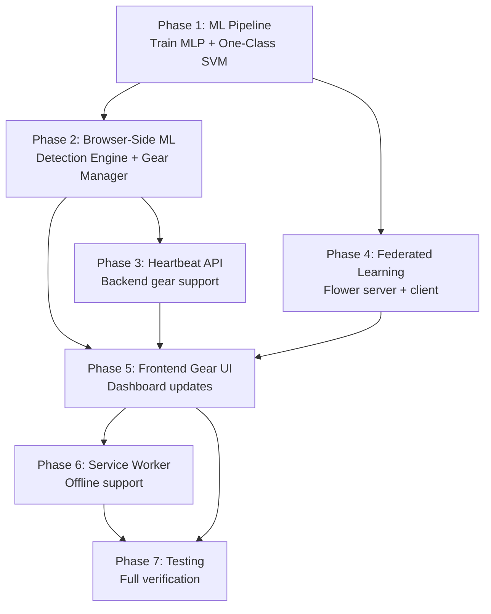

# BEZP Remaining Implementation Plan — Refined Architecture Alignment

## Current State Summary

The codebase has a solid **Phase 1** foundation already implemented:

### ✅ What's Done

| Component | Status | Details |
|-----------|--------|---------|
| **FastAPI Backend** | ✅ Complete | Sessions, Events, Clips, Users, Exams routers |
| **PostgreSQL Models** | ✅ Complete | User, Exam, ExamSession, DetectionEvent, GazeSnapshot, ProctorReview |
| **Redis Bridge** | ✅ Complete | Pub/Sub between detection worker and API |
| **WebSocket Layer** | ✅ Complete | Proctor ← events, Student ← commands (warn/terminate) |
| **Detection Pipeline** | ✅ Complete (Phase 1 stubs) | FaceGate (MediaPipe), YoloDetector, BackgroundMonitor, GazeEstimator (solvePnP stub), AnomalyDetector (threshold stub), RuleEngine |
| **Detection Worker** | ✅ Complete | FastAPI service receives base64 frames, runs pipeline, publishes to Redis |
| **Escalation Service** | ✅ Complete | Tier determination + composite critical logic |
| **Frontend (React+Vite)** | ✅ Complete | Auth, Student portal (ExamSession with webcam+detection+alerts+warning/terminate flow), Proctor dashboard (SessionMonitor with gaze timeline, event feed, warn→clip→review→terminate pipeline), Admin panel (CRUD exams, users, reports) |
| **Clip System** | ✅ Complete | 30s warning clip capture+upload, MinIO+local fallback, proctor clip review |
| **JWT Auth** | ✅ Complete | Register/Login with bcrypt+jose |
| **Docker Compose** | ✅ Complete | PostgreSQL, Redis, MinIO |
| **Tests** | ✅ Partial | Tests for anomaly detector, API, background monitor, face gate, gaze estimator, redis bridge, rule engine |

### ❌ What's Missing / Needs Refactoring

The current codebase was built against **v3.0 of the plan** (LSTM-based, continuous gaze streaming). The user's new refined description introduces **three major architectural shifts** that require significant changes:

---

## Gap Analysis: v3.0 (Current) → Refined Architecture (Target)

### Gap 1: Exception-Based Telemetry & 4-Gear System
**Current**: Client sends frames every 2 seconds to the detection worker. No heartbeat system. No gear/network adaptation on the client side. Network tier exists in the DB model but is server-assessed only (100KB probe every 30s mentioned in config but not implemented).

**Target**: Client maintains a local Trust Score with encrypted Heartbeat packets, gear-defined intervals (5s/15s/30s/silent), event bundling, video resolution adaptation, ML inference throttling, Service Worker + IndexedDB offline buffering, and automatic flush on recovery.

### Gap 2: Two-Stage ML Architecture (MLP + One-Class SVM/GMM)
**Current**: GazeEstimator uses solvePnP head-pose as a stub. AnomalyDetector uses simple threshold-based detection. Both have `TODO Phase 2` markers but no trained models.

**Target**: 
- **Model 1 (Spatial Gaze Estimator)**: Frozen MLP/Random Forest trained on MPIIGaze, taking 8 iris+eye-corner landmark coordinates → Pitch/Yaw output.
- **Model 2 (Temporal Anomaly Detector)**: Unsupervised One-Class SVM or GMM with 3-minute calibration, cluster-based boundary detection, 5-second sustained anomaly threshold.

### Gap 3: Tiny Payload Federated Learning
**Current**: `get_boundary_params()` exists on AnomalyDetector (exports mean/var). No Flower server, no FL client, no FL aggregation, no FL configuration in admin UI, no `fl_contributions` DB table.

**Target**: Flower-based FL pipeline where each client sends 4-6 numbers (mean_yaw, var_yaw, mean_pitch, var_pitch) post-exam. FedAvg aggregation updates the global boundary. Differential privacy noise, gradient validation gate, minimum 10 sessions before update.

---

## User Review Required

> [!IMPORTANT]
> **Detection Architecture Decision**: The current detection pipeline runs **server-side** — the client sends frames via HTTP to the detection worker. The new refined architecture describes all ML inference running **client-side in the browser**. This is a fundamental architectural choice:
> - **Option A (Browser-side ML)**: Move MediaPipe + Gaze MLP + Anomaly detector to run in the browser via TensorFlow.js / ONNX Runtime Web. The browser sends only events, never frames. This aligns perfectly with the privacy-first description.
> - **Option B (Keep Server-side)**: Keep the current server-side detection worker. Apply the 4-Gear system to how frames are sent (throttle/skip in Gear 3-4) and add heartbeats alongside.
> 
> **The user's description strongly implies Option A** (the client "maintains a local Trust Score", "ML inference throttled from 10 FPS to 2 FPS" locally, Service Worker intercepts events). **I will proceed with Option A** unless you specify otherwise.

> [!WARNING]
> **Audio Detection**: The v3.0 plan includes an Audio Anomaly Detection service (MFCC + CNN for multi-speaker detection). The new refined description does NOT mention audio at all. Should audio detection be:
> - Included as a future phase?
> - Dropped entirely from the plan?

> [!IMPORTANT]
> **MPIIGaze Training**: Training the MLP on MPIIGaze requires dataset download (~2GB), feature extraction, and training (suggested on Colab). Should I:
> - Create the training notebook/script as part of this plan?
> - Assume the trained model will be provided separately and focus only on integration?

## Open Questions

1. **Service Worker**: Should we implement a full Service Worker for offline buffering (IndexedDB + background sync), or is a simpler in-memory approach acceptable for now?
2. **Encryption**: The description mentions "50-byte encrypted Heartbeat packet". Should we implement actual AES encryption for heartbeats, or is HTTPS sufficient?
3. **UDP Emergency Packet**: Gear 4 mentions "100-byte emergency UDP packet" for CRITICAL alerts. Browsers cannot send raw UDP. Should we implement this as a `navigator.sendBeacon()` fallback instead?
4. **Exam Suspension Logic**: "Gear 4 lasting > 5 continuous minutes suspends the exam." Should the suspension be automatic, or should it notify the proctor for manual action?

---

## Proposed Changes

### Phase 1: Two-Stage ML Pipeline (Model Training & Integration)

The core ML refactoring — replace the solvePnP stub and threshold anomaly detector with real models.

---

#### [MODIFY] [gaze_estimator.py](file:///d:/4th%20sem/federated%20learning/new%20repo/detection/gaze_estimator.py)

**Complete rewrite** to implement the Spatial Gaze Estimator (Model 1):
- Remove the solvePnP head-pose estimation (Phase 1 stub)
- Add MLP model loading (scikit-learn `joblib` or ONNX format)
- Input: 8 normalized coordinates (4 iris landmarks + 4 eye-corner landmarks from MediaPipe)
- Output: Pitch and Yaw angles in degrees
- Keep the same `GazeResult` dataclass interface so the pipeline doesn't change
- The model file will be stored as `detection/models/gaze_mlp.onnx`

#### [MODIFY] [anomaly_detector.py](file:///d:/4th%20sem/federated%20learning/new%20repo/detection/anomaly_detector.py)

**Major refactoring** to implement the Temporal Anomaly Detector (Model 2):
- Replace threshold-based detection with One-Class SVM (scikit-learn)
- Implement 3-minute calibration phase that collects Pitch/Yaw points and fits a One-Class SVM boundary
- Detection: check if new gaze points fall outside the learned cluster
- 5-consecutive-second outside-cluster → `GAZE_ANOMALY` flag
- Export `get_boundary_params()` → micro-payload (mean_yaw, var_yaw, mean_pitch, var_pitch, covariance matrix)
- Accept global boundary params from FL to initialize/adjust the model

#### [NEW] `detection/training/train_gaze_mlp.py`

Training script for Model 1:
- Load MPIIGaze dataset (extracted features: iris coordinates + gaze targets)
- Extract the 8 landmark features matching MediaPipe Face Mesh indices
- Train a scikit-learn MLP or Random Forest
- Export to ONNX format for browser deployment (via `skl2onnx`)
- Save to `detection/models/gaze_mlp.onnx`

#### [NEW] `detection/training/extract_mpiigaze_features.py`

Feature extraction pipeline:
- Process MPIIGaze `.mat` files
- Run MediaPipe on the face images to extract the 8 iris+eye-corner coordinates
- Map to ground-truth gaze angles (provided by MPIIGaze)
- Output a clean CSV/NumPy dataset ready for training

#### [NEW] `detection/training/requirements.txt`

Training-specific dependencies (not needed at runtime):
- `scipy`, `h5py` (for MPIIGaze .mat files)
- `skl2onnx` (ONNX export)
- `onnxruntime` (validation)

---

### Phase 2: Browser-Side ML & Exception-Based Telemetry

Move detection intelligence to the browser. This is the biggest architectural shift.

---

#### [NEW] `frontend/src/lib/detectionEngine.js`

The **core browser-side detection engine**:
- Load MediaPipe Face Landmarker (WASM) in the browser
- Load the frozen Gaze MLP via ONNX Runtime Web (`onnxruntime-web`)
- Implement the Anomaly Detector (One-Class SVM) in JavaScript (simple distance-from-centroid check — no need for full sklearn)
- 3-minute calibration phase: collect Pitch/Yaw, compute mean/covariance
- Detection: Mahalanobis distance from calibration centroid > threshold → anomaly
- Maintain local Trust Score
- Export boundary params for FL

#### [NEW] `frontend/src/lib/gearManager.js`

The **4-Gear Network Adaptation System**:
- Network quality assessment via `navigator.connection` API + periodic RTT measurement (small fetch to `/health`)
- Gear classification logic:
  - Gear 1: >10 Mbps, RTT <50ms → heartbeat every 5s
  - Gear 2: 2-10 Mbps, RTT 50-150ms → heartbeat every 15s, bundle INFO events
  - Gear 3: 0.5-2 Mbps, RTT 150-500ms → heartbeat every 30s, drop INFO, throttle ML to 2 FPS
  - Gear 4: <0.5 Mbps, RTT >500ms → silence, IndexedDB buffer, emergency beacon for CRITICAL
- Exports `currentGear`, `shouldSendEvent(tier)`, `getHeartbeatInterval()`, `getVideoResolution()`, `getInferenceFPS()`

#### [NEW] `frontend/src/lib/heartbeatService.js`

Heartbeat and state-change protocol:
- Sends tiny 50-byte heartbeat JSON at gear-defined intervals
- Sends immediate event updates on state changes (WARNING/FLAG)
- Event bundling for Gear 2 (batch INFO events with next heartbeat)
- `navigator.sendBeacon()` fallback for Gear 4 CRITICAL events

#### [NEW] `frontend/src/lib/offlineBuffer.js`

IndexedDB offline buffering for Gear 4:
- Store events and video blobs when offline
- Background flush when network returns to Gear 2+
- 5-minute Gear 4 timer → exam suspension notification

#### [MODIFY] [ExamSession.jsx](file:///d:/4th%20sem/federated%20learning/new%20repo/frontend/src/pages/student/ExamSession.jsx)

**Major refactoring**:
- Remove server-side frame capture (`fetch('/detect/frame')` every 2s)
- Integrate `detectionEngine.js` for local ML inference on the webcam feed
- Integrate `gearManager.js` for network-adaptive behavior
- Integrate `heartbeatService.js` for state-change protocol
- Adjust video resolution based on current gear (720p/480p/360p)
- Show gear indicator in the UI (Gear 1-4 status)
- Rolling 30-second MediaRecorder buffer (re-enable the buffer that was removed)
- On FLAG: freeze buffer, compress to gear-appropriate resolution, upload

#### [MODIFY] [detection_pipeline.py](file:///d:/4th%20sem/federated%20learning/new%20repo/detection/detection_pipeline.py)

Reduce scope — this now only handles **server-side browser event processing** (tab switches sent via API) since ML runs client-side. The frame processing path becomes secondary/optional.

---

### Phase 3: API Heartbeat & Gear Endpoints

Backend support for the new telemetry protocol.

---

#### [NEW] `api/routers/heartbeat.py`

New router for heartbeat ingestion:
- `POST /api/heartbeat` — receive heartbeat packets, update session last_seen
- `POST /api/heartbeat/events` — receive batched events (Gear 2 bundling)
- `GET /api/heartbeat/network-probe` — return a small payload for RTT measurement
- Track session liveness — if no heartbeat for 2× the expected interval, mark session as potentially disconnected

#### [MODIFY] [session.py](file:///d:/4th%20sem/federated%20learning/new%20repo/api/models/session.py) (model)

Add fields:
- `current_gear: int` (1-4)
- `last_heartbeat_at: datetime`
- `gear_4_start: datetime | None` (for 5-minute suspension tracking)
- `trust_score: float` (synced from client periodically)

#### [MODIFY] [config.py](file:///d:/4th%20sem/federated%20learning/new%20repo/api/config.py)

Add gear-related configuration:
- `GEAR_1_HEARTBEAT_INTERVAL`, `GEAR_2_HEARTBEAT_INTERVAL`, etc.
- `GEAR_4_SUSPENSION_TIMEOUT_MINUTES = 5`
- `VIDEO_RESOLUTION_GEAR_1 = "720p"`, etc.

#### [MODIFY] [main.py](file:///d:/4th%20sem/federated%20learning/new%20repo/api/main.py)

Mount the new heartbeat router.

---

### Phase 4: Federated Learning (Tiny Payload FL)

Flower-based FL with micro-payload aggregation.

---

#### [NEW] `fl/server.py`

Flower FL server:
- Implements `flwr.server` with custom `FedAvg` strategy
- Aggregates boundary params (mean_yaw, var_yaw, mean_pitch, var_pitch) from N clients
- Weighted average based on sample_count
- Validation gate: reject updates that shift the boundary by > 2 standard deviations
- Minimum 10 sessions before updating global model
- Differential privacy: Gaussian noise injection on aggregated params
- Gradient norm clipping (max norm = 1.0)

#### [NEW] `fl/client.py`

Flower FL client adapter:
- Called at session end
- Receives boundary params from `AnomalyDetector.get_boundary_params()`
- Sends to FL server as `flwr.client.NumPyClient`
- Receives updated global boundary params

#### [NEW] `fl/__init__.py`

Package init.

#### [NEW] `api/routers/fl.py`

FL management API:
- `POST /api/fl/contribute` — receive boundary params from client at session end
- `GET /api/fl/global-model` — return current global boundary parameters
- `GET /api/fl/status` — FL metrics (round count, participant count, last update)

#### [NEW] `api/models/fl_contribution.py`

New ORM model `fl_contributions` table:
- `id`, `session_id`, `exam_id`
- `mean_yaw`, `var_yaw`, `mean_pitch`, `var_pitch`, `sample_count`
- `accepted: bool` (passed validation gate or not)
- `round_number: int`
- `contributed_at: datetime`

#### [MODIFY] [exam.py](file:///d:/4th%20sem/federated%20learning/new%20repo/api/models/exam.py) (model)

Add fields:
- `fl_model_version: int` (current FL model version)
- `fl_last_updated_at: datetime | None`
- `fl_min_sessions: int = 10`

---

### Phase 5: Frontend — Gear UI, FL Integration, & Proctor Dashboard Updates

---

#### [MODIFY] [SessionMonitor.jsx](file:///d:/4th%20sem/federated%20learning/new%20repo/frontend/src/pages/proctor/SessionMonitor.jsx)

Add to proctor view:
- Current gear indicator (color-coded Gear 1-4)
- Last heartbeat timestamp
- Trust score display
- Connection quality sparkline
- Offline duration tracking for Gear 4 sessions

#### [MODIFY] [ProctorDashboard.jsx](file:///d:/4th%20sem/federated%20learning/new%20repo/frontend/src/pages/proctor/ProctorDashboard.jsx)

Add to session grid:
- Gear indicator per session card
- Highlight sessions in Gear 3/4 (potential connectivity issues)
- Sort/filter by gear status

#### [MODIFY] [AdminDashboard.jsx](file:///d:/4th%20sem/federated%20learning/new%20repo/frontend/src/pages/admin/AdminDashboard.jsx)

Add FL section:
- FL model version and last update round
- Number of FL contributions
- Enable/disable FL per exam toggle
- Global boundary parameters visualization

#### [NEW] `frontend/public/models/`

Directory for browser-loaded model files:
- `gaze_mlp.onnx` — frozen Gaze Estimator
- `face_landmarker.task` — copy of MediaPipe model for browser use

---

### Phase 6: Service Worker & Offline Support

---

#### [NEW] `frontend/public/sw.js`

Service Worker for Gear 4 offline support:
- Intercept heartbeat/event fetch requests when offline
- Queue to IndexedDB (`bezp_offline_events` store)
- Background sync: flush queue when `online` event fires
- Track Gear 4 duration; post message to main thread at 5-minute mark

#### [MODIFY] [main.jsx](file:///d:/4th%20sem/federated%20learning/new%20repo/frontend/src/main.jsx)

Register the Service Worker on app load.

---

### Phase 7: Testing & Verification

---

#### [MODIFY] [test_gaze_estimator.py](file:///d:/4th%20sem/federated%20learning/new%20repo/tests/test_gaze_estimator.py)

Update tests to work with MLP-based estimator (mock ONNX model).

#### [MODIFY] [test_anomaly_detector.py](file:///d:/4th%20sem/federated%20learning/new%20repo/tests/test_anomaly_detector.py)

Update tests for One-Class SVM calibration + boundary detection.

#### [NEW] `tests/test_fl_server.py`

Test FL aggregation logic:
- FedAvg on boundary params
- Validation gate rejection
- Differential privacy noise
- Minimum session threshold

#### [NEW] `tests/test_heartbeat.py`

Test heartbeat API:
- Heartbeat ingestion
- Session liveness tracking
- Gear 4 suspension timer

#### [NEW] `frontend/src/lib/__tests__/gearManager.test.js`

Unit tests for gear classification logic.

---

## Verification Plan

### Automated Tests
```bash
# Backend tests
pytest tests/ -v

# Frontend build check
cd frontend && npm run build
```

### Manual Verification
1. **ML Pipeline**: Run the training script on MPIIGaze sample data, verify ONNX model loads and produces valid Pitch/Yaw
2. **Browser Detection**: Open ExamSession, verify MediaPipe + ONNX loads in browser, gaze tracking produces real-time angles in console
3. **4-Gear System**: Throttle network via DevTools → verify gear transitions, heartbeat interval changes, video resolution adaptation
4. **Offline Buffer**: Go fully offline → verify events queue to IndexedDB → go online → verify flush
5. **FL Pipeline**: Complete 2+ exam sessions → verify boundary params sent → run FL aggregation → verify updated global model
6. **Proctor Dashboard**: Verify gear indicators, trust scores, and heartbeat timestamps appear in real-time

### Integration Test Scenario
1. Register student + proctor accounts
2. Create exam with FL enabled
3. Student starts exam → verify Gear 1 heartbeats in backend logs
4. Throttle network → verify gear downshift → verify heartbeat interval change
5. Trigger tab switch → verify immediate event (not bundled) for WARNING/FLAG tier
6. End exam → verify FL boundary params submitted
7. Proctor monitors session → verify real-time events, gear indicator, gaze timeline

---

## Implementation Priority & Dependencies



> [!TIP]
> **Recommended execution order**: Phases 1 → 2 → 3 → 5 → 4 → 6 → 7. Phase 4 (FL) can be done in parallel with Phase 5 since they're independent until the admin UI integration.
